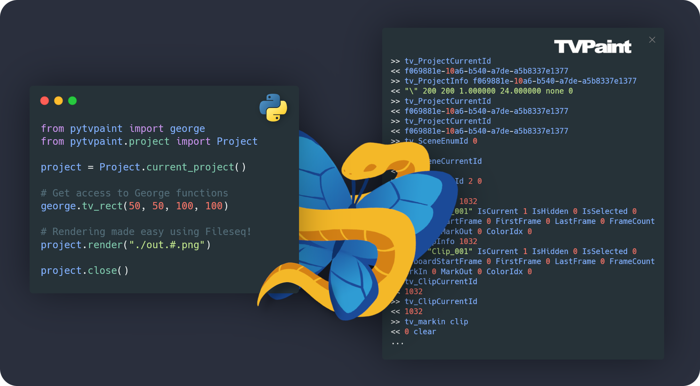

# Pytvpaint 🐍 → 🦋

<center>

</center>

**Pytvpaint** is a type-safe Python library that wraps the George programming language commands in order to interact with the 2D animation software TVPaint.

It communicates through WebSocket to a [custom C++ plugin](./cpp) running in an opened TVPaint instance.

## Installation

```console
❯ pip install pytvpaint
```

## Simple example

```python
from pytvpaint import george
from pytvpaint.project import Project

# get access to tvp elements
project = Project.load('scene.tvpp', silent=True)

clip = project.current_clip()
# or get the clip by name
clip = project.get_clip('my_clip')

layer = clip.add_layer('my_new_layer')
# check out other layers
for layer in clip.layers:
    print(layer.name)

# get access to George functions
george.tv_rect(50, 50 ,100, 100)

# render your file
clip.render('./out.#.png', start=20, end=45)

project.close()
```

## Contributing

Pull requests are welcome. For major changes, please open an issue first
to discuss what you would like to change.

Please make sure to update tests as appropriate.

## License

[MIT](./LICENSE.md)

<hr>

Made with ❤️ at [BRUNCH Studio](https://brunchstudio.tv/) 🥐🍳
