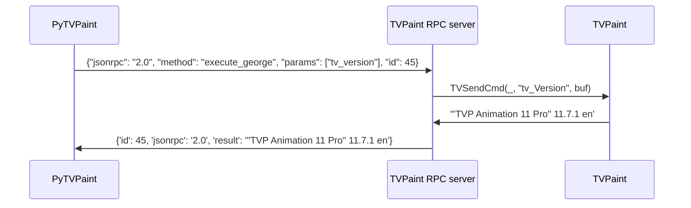

# How it works internally

The following diagram shows how each processes interact to make PyTVPaint work:

1. The end user calls [`tv_version()`](../api/george/misc.md#pytvpaint.george.grg_base.tv_version) from `pytvpaint.george` in Python.
2. It calls `send_cmd("tv_Version")` which is the low level function that sends george commands
3. It then calls `rpc_client.execute_remote("execute_george", ["tv_version"])`
4. The JSON-RPC client sends the serialized JSON payload to the server `self.ws_handle.send(json.dumps(payload))`
5. The C++ plugin receives the message and [store it in the George commands queue](https://github.com/brunchstudio/tvpaint-rpc/blob/main/src/server.cpp#L59).
6. George commands are executed in the main thread, so at each plugin tick we check if we have commands to execute, execute them with the C++ SDK function `TVSendCmd` and [send back the result](https://github.com/brunchstudio/tvpaint-rpc/blob/main/src/main.cpp#L110).
7. We get back the result in PyTVPaint and use the `tv_parse_list` function to parse the resulting string from George and return a tuple from `tv_version`.
