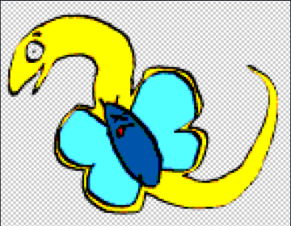
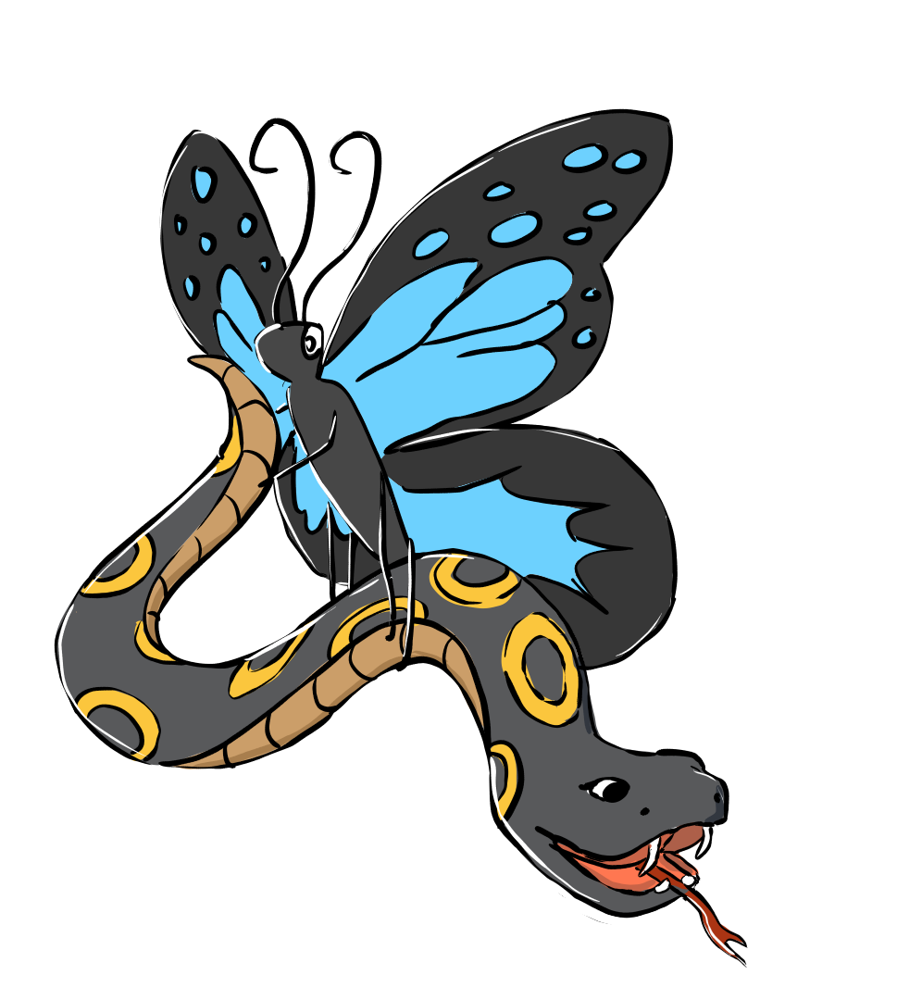
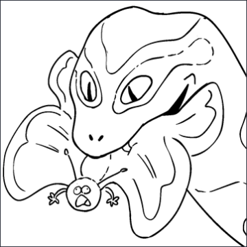

# Credits

## 💻 Brunch Dev Team

- [:simple-github:](https://github.com/rlahmidi) Radouane Lahmidi
- [:simple-github:](https://github.com/jhenrybrunch) Joseph Henry
- [:simple-firefoxbrowser:](https://www.chloeoternaud.com/about) Chloe Oternaud
- [:simple-github:](https://github.com/aprayez) Alexis Prayez

## 🙏 Special Thanks

### Brunch Studio for supporting the project

- Fabin Cellier : Head of Studio [:simple-linkedin:](https://www.linkedin.com/in/fabien-cellier-03545826/)
- Jean-Charles Kerninon : Head of CG [:simple-linkedin:](https://www.linkedin.com/in/jean-charles-kerninon-14309b3/)
- Emilie Revert : Head of 2D Productions [:simple-linkedin:](https://www.linkedin.com/in/emilie-revert-236279109/)

### Other Contributors:

- The C++ plugin was made possible with the already existing codebase of Ynput's [OpenPype TVPaint plugin](https://github.com/ynput/OpenPype/tree/develop/openpype/hosts/tvpaint/tvpaint_plugin/plugin_code).
- Also thanks to [Jakub Trllo](https://www.linkedin.com/in/jakub-trllo-751387a6/) from Ynput who helped with the C++ implementation on their Discord server.
- The TVPaint dev team for their patience and help with our questions and the [George commands documentation](https://www.tvpaint.com/doc/tvpaint-animation-11/george-commands) from TVPaint.

### Logo

{ width="300" }

The official Pytvpaint logo was made by Juliette Danesi ( [:simple-linkedin:](https://www.linkedin.com/in/juliette-danesi-1427561b6/) [:link:](https://juliettedanesi.wixsite.com/monsite/layout-posing) ) at BRUNCH Studio. :sparkles:

## 💎 Brunch gems

A special thanks also to our wonderful artists at the studio who also submitted some very interesting logos for the project.

These were obviously made as a joke, and do not represent the true skills of these talented individuals :sweat_smile:

- Milo Pottier [:simple-linkedin:](https://www.linkedin.com/in/milo-pottier-6b8971152/)

{ width="300" }

- Alphée Note [:simple-linkedin:](https://www.linkedin.com/in/alphee-n/)

{ width="300" }

- Pierre Yves Vauzelle [:simple-linkedin:](https://www.linkedin.com/in/pierreyves-vauzelle/)

{ width="300" }
