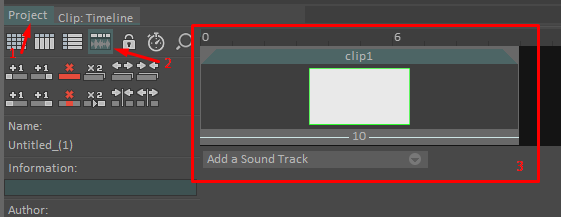
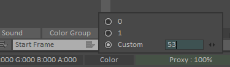

# Usage

PyTVPaint offers **two ways** to interact with TVPaint.

The recommended one is to use the [**object-oriented API**](#object-oriented-api) which handles all the nitty-gritty details of George 
and provides an extra layer of features. The classes can be imported from `pytvpaint.*`

The other way is to use the [**wrapped George functions**](#george-functions) in Python which behave almost exactly as 
their George counterparts. These can be imported from `pytvpaint.george.*`.

## Environment variables

PyTVPaint can be configured using these variables:

| Name                              | Default value    | Description                                                                                                                    |
|:----------------------------------|:-----------------|:-------------------------------------------------------------------------------------------------------------------------------|
| `PYTVPAINT_LOG_LEVEL`             | `INFO`           | Changes the log level of PyTVPaint. Use the `DEBUG` value to see the RPC requests and responses for debugging George commands. |
| `PYTVPAINT_WS_HOST`               | `ws://localhost` | The hostname of the RPC over WebSocket server ([tvpaint-rpc](https://github.com/brunchstudio/tvpaint-rpc) plugin).             |
| `PYTVPAINT_WS_PORT`               | `3000`           | The port of the RPC over WebSocket server ([tvpaint-rpc](https://github.com/brunchstudio/tvpaint-rpc) plugin).                 |
| `PYTVPAINT_WS_STARTUP_CONNECT`    | `1`              | Whether or not PyTVPaint should automatically connect to the WebSocket server at startup (module import). Accepts 0 or 1.      |
| `PYTVPAINT_WS_TIMEOUT`            | `60` seconds     | The timeout after which we stop reconnecting at startup or if the connection was lost.                                         |

## Automatic client connection

When you first import `pytvpaint`, a WebSocket client is automatically created and tries to connect to the server run by the [C++ plugin you installed](./installation.md).

For example in an interactive Python shell:

```console
>>> from pytvpaint.layer import Layer
[2024-02-26 12:39:00,634] pytvpaint / INFO -- Connected to TVPaint on port 3000
```

!!! tip

    Set the `PYTVPAINT_LOG_LEVEL` environment variable to `INFO` to see the log above.

!!! tip

    You can disable this automatic behavior by setting the `PYTVPAINT_WS_STARTUP_CONNECT` variable to `0`.

## Object-oriented API

PyTVPaint provides an object-oriented API that handles the George calls behind the scenes. Most objects in TVPaint have 
their own implementation (`Project`, `Scene`, `Clip`, `Layer`...).

### Getting the current data in TVPaint

Most of the classes provide a way to get the **current** element in TVPaint because the current state of the open 
TVPaint instance matters when querying data from TVPaint.

For example to get the current clip:

```python
from pytvpaint.clip import Clip

clip = Clip.current_clip()

# You can also get the current layer
layer = clip.current_layer
```

### Structure

The API follows the structure of TVPaint projects in this order: `Project -> Scene -> Clip -> Layer`.

In practice you can do this:

```python
from pytvpaint import Project

project = Project.current_project()

for scene in project.scenes:
    for clip in scene.clips:
        for layer in clip.layers:
            print(layer)
```

### Generators

Since George commands are time expensive to run, most of the properties that returns objects are in fact generators of objects.

For example:

```python
for layer in clip.layers:
    # Do something with layer, consumes it

# To get the list of layers you need to consume the whole generator
layers = list(clip.layers)
```

### Data refreshing

To keep an up-to-date state of the objects in TVPaint (since changes can happen through both the code and the UI), 
The library "refreshes" the objects any time a property or method is called by querying TVPaint before running some commands.
This sometime means jumping from element to element (projects, clips, etc...) in the UI.

For example getting the project path:

```python
from pytvpaint import Layer

layer = Layer.current_layer()

# Gets the layer name
layer_name = layer.name

# The user changes the layer name in the interface...

# The name property gives the right value
refreshed_name = layer.name
```

### Invalid and removable objects

Another issue we are facing is that if you have a Python object instance representing a layer and you remove that layer in TVPaint, then the Python object is no longer _valid_.
Another issue we are facing is objet deletions. Let's say you have a Python `Layer` object, and you remove it in the TVPaint UI, 
that the Python object is no longer _valid_.

There's two ways an object can be considered invalid:

1. The programmer explicitly removed the object by calling the `.remove()` method.
2. The object itself was removed from the TVPaint interface.

In this example we remove a layer and try to access it afterward:

```python
from pytvpaint import Layer

layer = Layer.current_layer()
layer.remove()

# Will raise a ValueError: Layer has been removed!
print(layer.name)
```

This is the same if we close the project containing the layer:

```python
from pytvpaint import Project

project = Project.current_project()
layer = project.current_clip.current_layer

project.close()

# Will raise an error when we try to access properties
print(layer.name)
```

## Utilities

### Undoable

In George, you can manage the undo/redo stack with the [`tv_undoopenstack`](api/george/misc.md#pytvpaint.george.grg_base.tv_undo_open_stack) and [`tv_undoclosestack`](api/george/misc.md#pytvpaint.george.grg_base.tv_undo_close_stack) functions.

In order to facilitate this process, we provide : 

- the [`undoable`](api/george/misc.md#pytvpaint.george.grg_base.undoable) decorator 
- the [`undoable_stack`](api/george/misc.md#pytvpaint.george.grg_base.undoable_stack) context manager.

Undo a whole function:

```python
from pytvpaint import george


@george.undoable
def some_george_actions():
    george.tv_bookmark_clear(5)
    george.tv_background_set(george.BackgroundMode.NONE)
```

Or only register some operations:

```python
from pytvpaint import george
from pytvpaint.project import Project


def some_george_actions():
    with george.undoable_stack():
        p = Project.new("./project.tvpp")
        p.start_frame = 67

    p.add_sound("test.wav")
```

### Rendering Contexts

TVPaint's rendering functions do not provided an easy way to set render settings, you are expected to set 
these yourself and restore them to their previous values when done. 
PyTVPaint provides two helpful context functions to make this easier:

- the [`render_context`](api/utils.md#pytvpaint.utils.render_context) context manager.
- the [`restore_current_frame`](api/utils.md#pytvpaint.utils.restore_current_frame) context manager.

!!! Note

    Our `Clip.render` and `Project.render` functions already use these contexts so you don't have to.

#### `render_context`
Using `render_context` will :

- Set the alpha mode and save format (with custom options)
- Hide / Show the given layers (some render functions only render by visibility)
- Restore the previous values after rendering

```python
from pytvpaint.utils import render_context

with render_context(
    alpha_mode,
    save_format,
    format_opts,
    layer_selection=[my_layer],
):
    george.tv_save_image(export_path)
```

#### `restore_current_frame`
Context that temporarily changes the current frame to the one provided and restores it when done.

```python
from pytvpaint.utils import restore_current_frame

with restore_current_frame(my_clip, my_render_frame):
    george.tv_save_display(export_path)
```

## George functions

The George functions are implemented in the [`pytvpaint.george`](./api/george/project.md) module, sorted by the type of TVPaint element they operate on.

The idea is to map these closely the real George functions documented [here](https://www.tvpaint.com/doc/tvpaint-animation-11/george-commands) (parameters, return types, enum values...).

!!! note

    Not all George functions are implemented in the library for now. Some are quite complicated to "translate" but 
    others are trivial. For now we only implemented the functions that suit our needs in our pipeline. Feel free to 
    make a PR or write an issue on Github if you want to contribute !

Here is an example of how you can use the basic/wrapped George functions:

```python
# Handy because you have access to all the functions within a single module
from pytvpaint import george

current_layer_id = george.tv_layer_current_id()
george.tv_layer_anim(current_layer_id)

# All the _info functions return a dataclass containing the returned values (here TVPLayer)
name = george.tv_layer_info(current_layer_id).name

george.tv_layer_rename(current_layer_id, f"{name}_anim_layer")
```

!!! success

    And that's it! No more `PARSE result` in George and everything is type-hinted and documented! 
    We still recommend using the high level API though, if you found that something is missing, please open an issue!


## Rendering : timelines, frame ranges and Fileseq

### Sequence parsing with Fileseq

When providing an output path to our functions, we use the handy Python library [Fileseq](https://github.com/justinfx/fileseq) 
for parsing and handling the expected frame ranges, which means you can use frame range expressions when rendering a clip or a project.

For example, you can use:

```python
from pytvpaint.clip import Clip

clip = Clip.current_clip()
clip.render("./out.10-22#.png")
# this will render a sequence of (10-22) like so out.0010.png, out.0011.png, ..., out.0022.png

# this is the same as doing
clip.render("./out.#.png", start=10, end=22)
```

### Frame ranges and timeline

Handling frame ranges in TVPaint can be difficult, depending on the object (project, clip, layer) and on the mark in/out,
range values tend to change and are seemingly handled differently between the UI and the code.

PyTVPaint handles frames differently in an effort to have a similar behaviour to the other industry software we're 
familiar with (Premiere, Maya, etc...). Meaning that the ranges provided to the API will have to be formatted a certain 
way, with the API handling all the appropriate range conversion behind the scenes. 

To explain how this works we first need to review how TVPaint handles ranges (grab a cup coffee, this might take a while...).

!!! Info

    Since the George documentation can be sometimes lacking in detail, all the explanations below are infered from our 
    tests and might be wrong in some aspects, please take this all with a grain of salt.

First let's start by reviewing the two main functions used for rendering in TVPaint. for the sake of brevity, we 
will ignore the other rendering functions like [`tv_SaveDisplay`](api/george/project.md#pytvpaint.george.grg_clip.tv_save_display) 
as these have no range selection options. We will also ignore all the clip export functions (JSON, Flix, etc...) as these behave in the 
same way as `tv_SaveSequence` (which we will review below) when handling ranges.


| Method                                                                                  | Description       | Can Render Camera |
|:----------------------------------------------------------------------------------------|:------------------|-------------------|
| [`tv_ProjectSaveSequence`](api/george/project.md#pytvpaint.george.grg_project.tv_project_save_sequence) | Renders a project | True              |
| [`tv_SaveSequence`](api/george/layer.md#pytvpaint.george.grg_clip.tv_save_sequence)     | Renders a clip    | False             |


#### Setup

Let's start with a simple example. a Project that contains a single clip which in turn contains a single Layer. 
The layer has a single instance with a length of 10 frames and starts at the clip start. Finally, let's also set the 
project start frame at 0  

 <figcaption style="font-size:0.7em">figure 1</figcaption>

 <figcaption style="font-size:0.7em">figure 2</figcaption>

Let's also switch to the timeline view in the project 

 <figcaption style="font-size:0.7em">figure 3</figcaption>

We now have a project with a range of `(0-10)`, a clip `clip1` with a range of `(0-10)` and finally a layer `layer1` also with a range of `(0-10)`. 
So far so good.

!!! Note

    we're ignoring the Scene objects in these examples since they do not really impact the frame range.

#### Testing and Rendering Examples

if we want to render `clip1` we could do this :

```python
from pytvpaint import george

# render the clip
george.tv_save_sequence('out.#.png', 0, 10)

# or render the project
george.tv_project_save_sequence('out.#.png', start=0, end=10)
```

These will all work and render our sequence of `(0-10)` frames. Let's go a bit further now and change the start frame to `53` 
_(figure 4)_. Our project timeline and clip range are shown as starting at 53 in the UI, _(see figures 5 and 6)_.  

 <figcaption style="font-size:0.7em">figure 4</figcaption>

 <figcaption style="font-size:0.7em">figure 5</figcaption>

 <figcaption style="font-size:0.7em">figure 6</figcaption>

You would assume that rendering our sequence again would mean us using our new range `(53-62)` like this :

```python
# render clip new range
george.tv_save_sequence('out.#.png', 53, 62)

# or render the project
george.tv_project_save_sequence('out.#.png', start=53, end=62)
```

this works...kind of, we'll get back to this later. For now, we do end up with a sequence of 10 frames `(53-62)`.

Again, let's go further and move the first image in the layer one frame to the right. Let's also add a mark in and out 
to our clip at `(55, 60)` like shown below.

 <figcaption style="font-size:0.7em">figure 7</figcaption>

So now our project still has one clip but with a range `(53-63)` and one layer with a new range as well `(54-63)` since we moved it 
one frame to the left.

If we render this again just like we did above, we start to see some inconsistencies.

```python
george.tv_save_sequence('out.#.png', 53, 63)
# => renders a sequence of 11 frames with a range of (53-63) 

george.tv_project_save_sequence('out.#.png', start=53, end=63)
# ERROR : only renders 6 frames
```

It seems rendering the project yields only 6 frames instead of our new range of 11 frames `(53-63)`. No matter, 
rendering the clip seems to work, so let's just only use `tv_save_sequence` from now on !...Well, it turns out rendering 
the clip doesn't work either. We do end up with the number of frames we asked for, but we've actually been rendering 
the wrong frames ever since we changed the project's start frame to `53`. So let's set the project's start frame back to 
`0` and try to render again, like so :

```python
# reset the project start frame
p.start_frame = 0

george.tv_save_sequence('out.#.png', 0, 11)
# => renders a sequence of 11 frames with our updated range of (0-11) 

george.tv_project_save_sequence('out.#.png', start=53, end=63)
# ERROR : only renders 6 frames
```
Somehow we still end up with missing frames even tough we reverted to the previous project start frame, 
so what's happening ?

#### Understanding TVPaint's timeline

To understand what's happening we need to understand how TVPaint handles its timeline...and the answer is that it doesn't
really handle a timeline. TVPaint's elements are handled more like lists than anything else, so all elements start at `0` 
and have a range of `(0 to N)`, however there are really two lists; projects have their timeline/list and clips also have 
their own timeline/list that is connected to the project's timeline. So to recap:  

- Clip: a clip's timeline always starts at 0 and goes to N, N being the last image in the "longest" layer in the clip.
- Project: a project's timeline always starts at 0 and goes to N, N being the last frame in the last clip of the project.
- Layer : layers use the same timeline as their parent clip.

Many things can affect these timelines and change the way we have to provide the rendering range to TVPaint. In the 
sections below, we will go over these timeline changing elements.

#### Project Start Frame

Changing the project's start frame actually doesn't change the previously mentioned lists, they still start at 0, 
it's just the TVPaint UI showing the timeline with an added 53 _(again figures 4 and 5 in sections above)_, which can 
be pretty misleading _(as seen in the example above)_. 

So this explains why the images we rendered in our very first example were correct but not the ones after we changed the 
project's start frame. So to correct our second example, we'd need to subtract the project's start frame from the range 
we want to render, like so :

```python
p_start = 53
start, end = (53, 63)
# clean range before render
start = (start - p_start)  # 0
end = (end - p_start)  # 10

george.tv_save_sequence('out.#.png', start, end)
# => renders a correct sequence of 11 frames with a range of (53-63) (as seen in the timeline in the Clip's UI) 

george.tv_project_save_sequence('out.#.png', start=start, end=end)
# ERROR : only renders 6 frames corresponding to the range (53-58) (as seen in the timeline in the Project's UI) 
```

Except we kind of tried this already when we reverted the project start frame to 0, and it still doesn't work, with 
`tv_project_save_sequence` only rendering 6 frames.

#### Mark IN/OUT

The reason the project has only been rendering 6 frames is because we set a mark IN and OUT on the clip at `(55-60)`. 
This means that the project now only sees the frames between the mark IN and OUT _(see figures 8 and 9 below)_. If we had only set the mark 
IN but not the mark OUT, the project would see all the frames between the mark IN and the clip's end frame and vice versa.

 <figcaption style="font-size:0.7em">figure 8 - No Mark IN/OUT</figcaption>

 <figcaption style="font-size:0.7em">figure 7 again - Clip Timeline with Mark IN/OUT at 55/60</figcaption>

 <figcaption style="font-size:0.7em">figure 9 - Project Timeline with same clip Mark IN/OUT at 55/60</figcaption>

So this explains why we only had 6 frames rendered, since the duration of the range `(55-60)` is equal to 6 frames.
You probably noticed that there is still an issue. The project now says it's range is `(53-59)` _(figure 9 above)_ while the clip
says it's range _(when taking the Mark IN/OUT into account)_ is at `(55-60)` and it's full range is _(without mark IN/OUT)_ is `(53-63)` _(figure 7 above)_

This is not a bug, when you take into account the fact that the project's timeline is separate from the clip timeline and 
ignores the frames outside the Mark IN/OUT it starts to make sense. 

We know the project start frame is ignored by the George rendering functions (as mentioned above) and all timelines (project and clip) 
really start a 0. So our project would only see 6 frames in the clip (the one between Mark IN `55` and the Mark OUT `60`), 
the project's timeline is really `(0-5)` + the project start frame `53` and we get `(53-58)`. 

So to fix our previous example and render our clip from the project we would need to do this

```python
p_start = 53

start, end = (53, 63)
# clean range before render
start = (start - p_start)  # 0
end = (end - p_start)  # 10

mark_in, mark_out = (55, 60)
# clean mark IN/OUT range before render
mark_in = (mark_in - p_start)  # 2
mark_out = (mark_out - p_start)  # 7

george.tv_save_sequence('out.#.png', start, end)
# => renders a correct sequence of 11 frames with a range of (53-63) (as seen in the timeline in the Clip's UI) 

george.tv_save_sequence('out.#.png', mark_in, mark_out)
# => renders a correct sequence of 6 frames with a range of (55-50) (as seen in the timeline in the Clip's UI) 

render_duration = (mark_in - mark_out) + 1  # 6
george.tv_project_save_sequence('out.#.png', start=0, end=render_duration)
# => renders a correct sequence of 6 frames with a range of (53-58) (as seen in the timeline in the Project's UI) 
```

!!! Note

    Just like Clips, Projects can also have a Mark IN/OUT separate from the clip's, however the project's Mark IN/OUT do 
    not affect the timeline, so we can ignore them.


!!! Tip

    This is also the way you set the Mark IN/OUT, current frame, JSON exports, etc... in Clips and Project


We now have a correct way to render our clip from the clip and the project, great ! But we're not done yet, what if we 
have multiple clips.

#### Multiple Clips
We figured out how to handle ranges when rendering a clip using `tv_save_sequence`. We also figured out how to render 
a project with one clip correctly. 

Now let's add another clip to the project, we'll place it after our first clip and call it `clip2`. Add a single 
layer `layer2` to it with 5 frames so a range of `(0-4)` for the clip and layer or `(53-57)` as shown in the UI _(see figure 10 below)_

 <figcaption style="font-size:0.7em">figure 10 - New Clip/Layer with 5 frames</figcaption>

From our tests earlier, we know that the new clip should show up in the project's timeline after the first one so 
at `(59-63)` as shown in the UI _(see figure 11 below)_ or more accurately at `(6-10)` if we see them as list indices. 
And that's exactly what we're getting. 

 <figcaption style="font-size:0.7em">figure 11 - New Clip/Layer in the project</figcaption>

So if we want to render the new clip we would do :

```python

# rendering from the clip, using the clip's timeline
george.tv_save_sequence('out.#.png', 0, 4)
# => renders a correct sequence of 5 frames with a range of (53-57) (as seen in the timeline in the Clip's UI) 

# rendering from the project, using the project's timeline
george.tv_project_save_sequence('out.#.png', start=6, end=10)
# => renders a correct sequence of 6 frames with a range of (59-63) (as seen in the timeline in the Project's UI) 
```

#### Rendering the camera

!!! tip

    Rendering the camera does not affect the timeline, however only `tv_project_save_sequence` has an option to render the 
    camera. So you'll have to use the project and it's range to render any frames with the camera.

#### Invalid Ranges

An invalid range can be provided to both functions and instead of raising an error, both will render some frames. 
Here we will try to describe the observed behavior when encountering an invalid range.

!!! info

    A rendering range is considered invalid if it starts before the Project's or Clip's start frame and ends after 
    the Project's or Clip's end frame 

For a project using `tv_project_save_sequence`

| Range Error                                   | Renders                           |
|:----------------------------------------------|:----------------------------------|
| range starts before the project's start frame | Renders all images in the project |
| range ends after the project's end frame      | Renders all images in the project |

For a clip using `tv_save_sequence`

| Range Error                                                                                              | Renders                                                                          |
|:---------------------------------------------------------------------------------------------------------|:---------------------------------------------------------------------------------|
| range starts before the clip's start frame                                                               | Renders all images, images will be empty if outside of clip range                |
| range ends after the clip's end frame                                                                    | Renders all images, images will be empty if outside of clip range                |
| range start is equal to clip's start frame but range ends after the clip's end frame                     | Renders the clip's range only, anything outside the clip's range is not rendered |
| range start is different from clip's start frame and range ends before, at or after the clip's end frame | Renders the clip's range only, images will be empty if outside of clip range     |
| range start and end are both inferior to clip's start frame                                              | Renders the clip's range only, anything outside the clip's range is not rendered |

#### How PyTVPaint handles a frame range

We it comes to our API, we take a very `what you see is what you get` approach when handling the timeline. Basically if timeline in the UI says 
that your clip's range is `(55-60)` (as seen in the examples above) then that is what you should provide to our functions.
PyTVPaint will handle the range conversion behind the scenes.

```python
from pytvpaint.clip import Clip

c = Clip.current_clip()

c.render('out.#.png', 55, 60)
# or render using the camera
c.render('out.#.png', 55, 60, use_camera=True)
# or when using FileSequence expressions
c.render('out.55-60#.png', use_camera=True)
# => renders a correct sequence of 6 frames with a range of (55, 60) (as seen in the timeline in the Clip's UI) 

# we could also do this
c.render('out.#.png', c.start, c.end)
```

For the second clip, and it's range of `(53-57)`, we would render it this way:

```python
from pytvpaint.clip import Clip

c2 = Clip.current_clip()

c2.render('out.#.png', 53, 57)
# or when using FileSequence expressions
c2.render('out.53-57#.png')
# => renders a correct sequence of 5 frames with a range of (53, 57) (as seen in the timeline in the Clip's UI) 
```

if we need to render the project, or part of it, let's say the second clip, which has a range of `(59-63)` in the 
project's timeline _(see figure 11 above)_

```python
from pytvpaint.project import Project

p = Project.current_project()

p.render('out.#.png', 59, 63)
# or render using the camera
p.render('out.#.png', 59, 63, use_camera=True)
# => renders a correct sequence of 5 frames with a range of (59, 63) (as seen in the timeline in the project's UI)

# we can also use the clip's properties to get its range in the project's timeline
c2 = p.get_clip(by_name="clip2")
print(c2.timeline_start)  # => 59
print(c2.timeline_end)  # => 63
```
 

!!! Success

    This is also the way you provide ranges and frames to all our API's functions. So when setting the current frame, 
    the Mark IN/OUT etc... remember to base your range on the UI.  
 

!!! Warning

    PyTVPaint uses `tv_project_save_sequence` to render frames for the project and the clips, this means that when 
    rendering a clip, it will consider any range outside the clip's Mark IN/OUT (if they have been set) as invalid. 
 

!!! Warning

    Unlike TVPaint, PyTVPaint will raise a ValueError when provided with an invalid range. If you'd like to render an 
    invalid range anyways, then consider using these wrapped functions directly (`george.tv_project_save_sequence`
    , `george.tv_save_sequence`). This also means that you will have to do the range conversions yourself, as shown 
    in the examples above.

